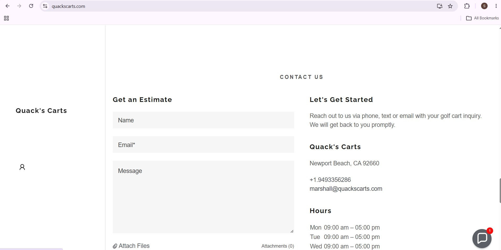

# Bug #4: Email Hover Cursor Does Not Change

## Title
Email link hover cursor does not change to pointer

## Environment
- Browser: Chrome (latest)
- OS: Windows / Mac
- Device: Desktop
- URL: https://quackscarts.com/ (Contact Us section)

## Steps to Reproduce
1. Navigate to https://quackscarts.com/
2. Scroll to the "Contact Us" section
3. Hover the mouse over the email address/link
4. Observe the cursor

## Expected Result
The cursor is not clickable. The email should also be a clickable mailto: link.

## Actual Result
The cursor does not give any visual indication that the email is interactive. The email is not a clickable link.

## Severity
Low

## Priority
Low

## Screenshot

